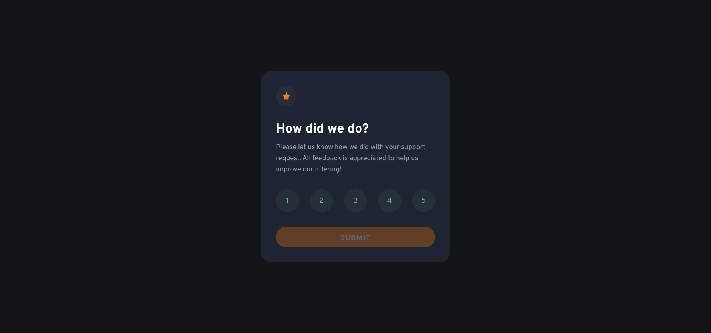

# Interactive Rating Component | solution to the Frontend Mentor challenge

This is a solution to the [Interactive rating component challenge on Frontend Mentor](https://www.frontendmentor.io/challenges/interactive-rating-component-koxpeBUmI). Frontend Mentor challenges help you improve your coding skills by building realistic projects.

## Screenshot

## Links

- Live Site URL: ()

## Features

- Select a button with a rating from 1 to 5, then click the 'SUBMIT' button
- After clicking the 'SUBMIT' button, a message will be displayed with the rating you have selected
- The 'SUBMIT' button will not work until a rating has been selected

## Built with

- HTML5
- CSS3
- Angular
- TypeScript

## Author

- Frontend Mentor - (https://www.frontendmentor.io/profile/k-malkiewicz)
- Codewars - (https://www.codewars.com/users/k_malkiewicz)